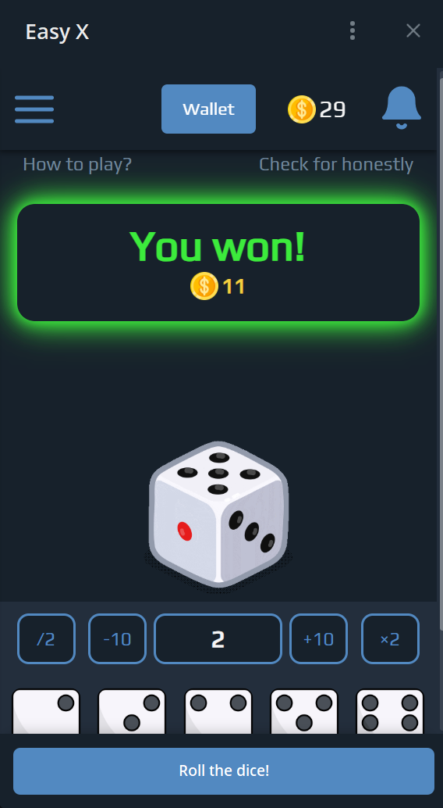
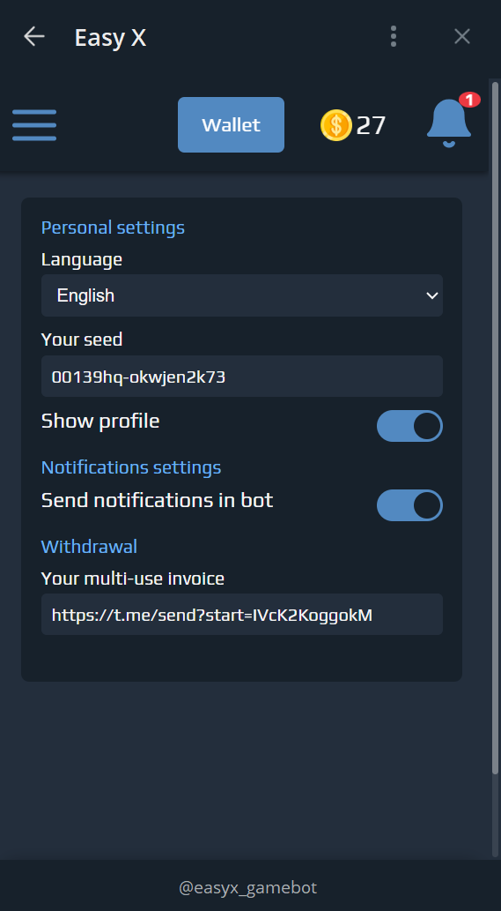

# Telegram Mini App - Casino Platform 🎰

## 📌 Description
A Telegram mini-app combined with a web casino platform. The app includes real-time balance updates and notifications, multilingual support, and full integration with the Telegram bot.

## 🚀 Features
- Django backend with Aiogram-powered Telegram bot
- Real-time balance updates via WebSockets and AJAX
- Multilingual support (i18n, 3 languages)
- Telegram bot notifications triggered by site events
- Referral system for user growth
- Deployed on VPS, managed via Git
- PostgreSQL as primary database

## 🖼️ Screenshots

## 🛠️ Tech Stack
- Django
- Aiogram
- PostgreSQL
- WebSockets
- AJAX
- i18n
